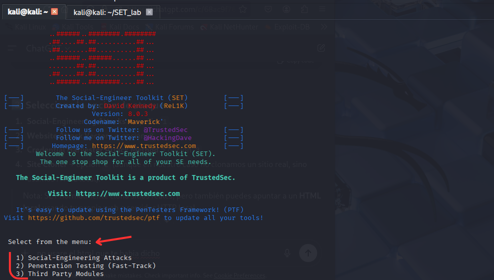
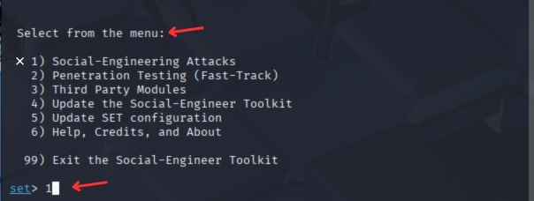
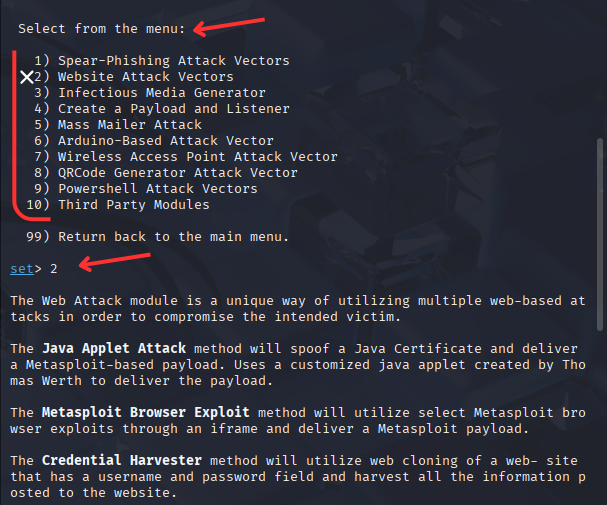
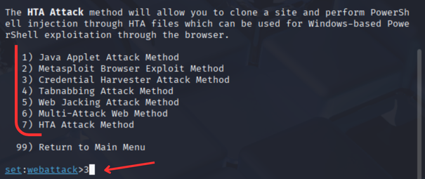
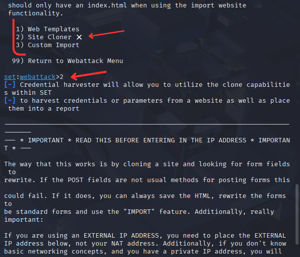
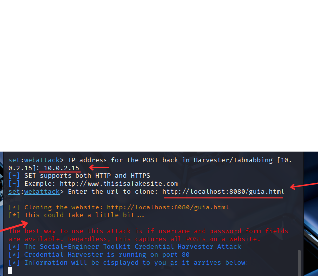
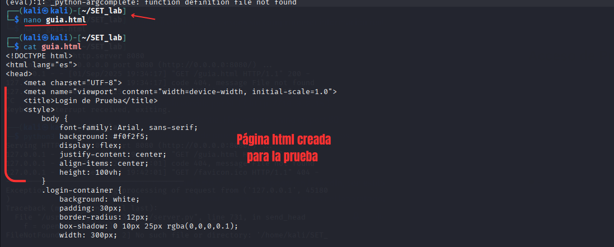
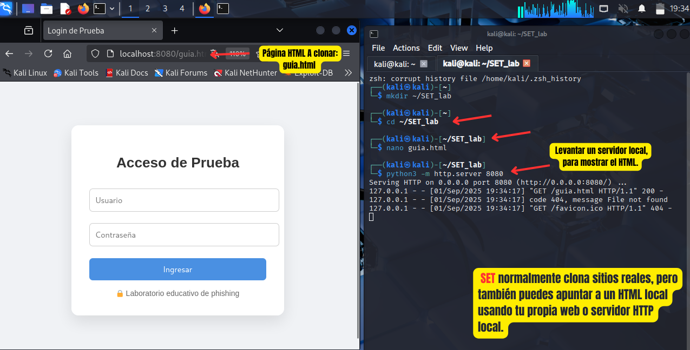
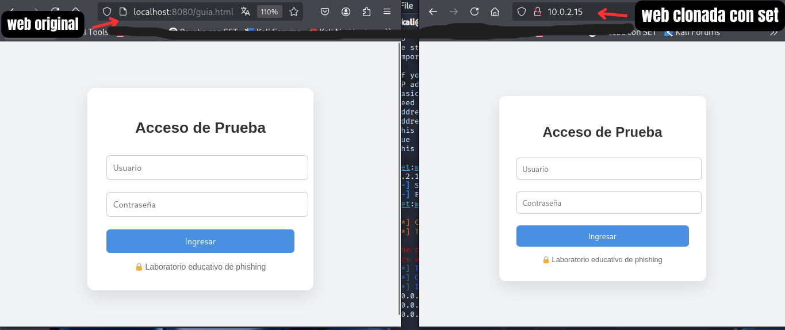

# SET-Tool

# Laboratorio Educativo: Clonación de Páginas Web con SET

Este repositorio contiene un archivo **HTML de prueba (`guia.html`)** diseñado para realizar un laboratorio seguro sobre **phishing y clonación de páginas web** utilizando **SET (Social Engineering Toolkit)** en Kali Linux.

El objetivo es **concienciar y enseñar** cómo los atacantes pueden clonar páginas web, de manera controlada y educativa, sin afectar a usuarios reales.

## Flujo del laboratorio

 1️⃣ Diseñar un archivo HTML de prueba (guia.html) con contenido educativo.

https://github.com/ImaneLamriui/SET-Tool/blob/main/guia.html

 2️⃣ Ejecutar SET → Social-Engineering Attacks → Website Attack Vectors → Credential Harvester → Site Cloner.
 

 3️⃣ Levantar un servidor local en Python:
 
 🔸 python3 -m http.server 8080
 
 4️⃣ Indicar la IP(local) de la máquina y la URL a clonar
 
 🔸 10.0.2.15 y http://localhost:8080/guia.html
 
 5️⃣ SET clona la página y la sirve en http://IP_VM
 

## Resultado

 ✅ página clonada accesible en el navegador, IDÉNTICA a la página original.
 
 ✅ SET levanta su propio servidor y (si hay fomulario) puede CAPTURAR INTERACCIONES para mostrar cómo funciona un ataque real de phishing.

 
