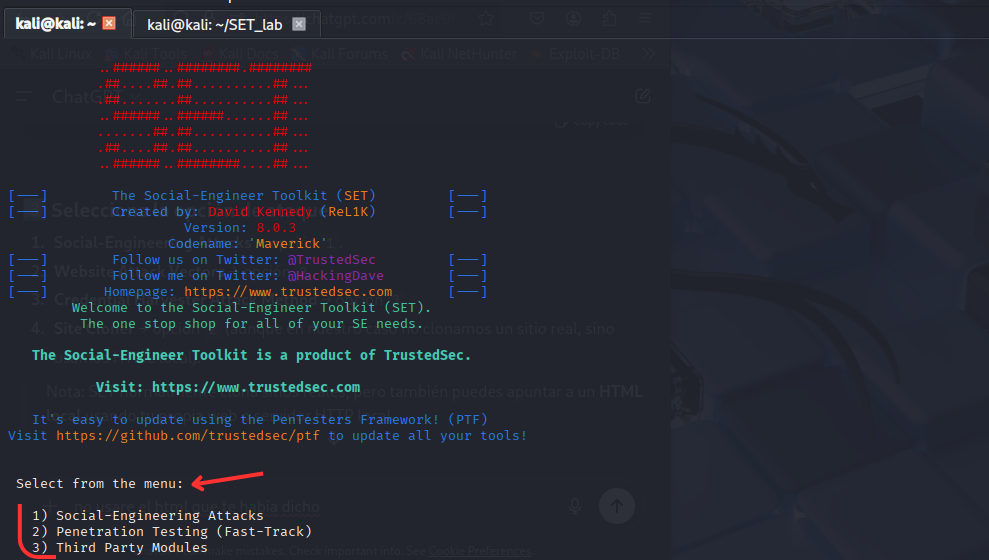
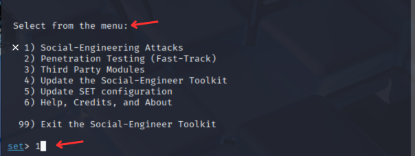
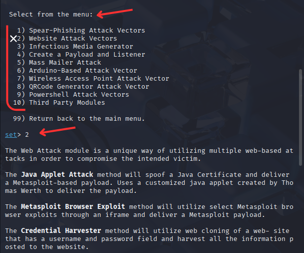
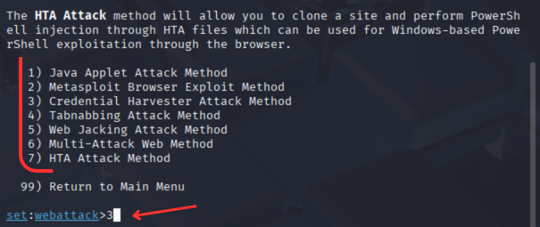
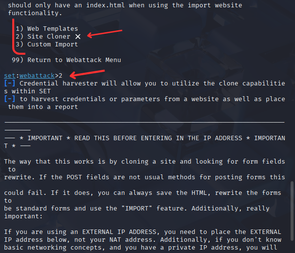
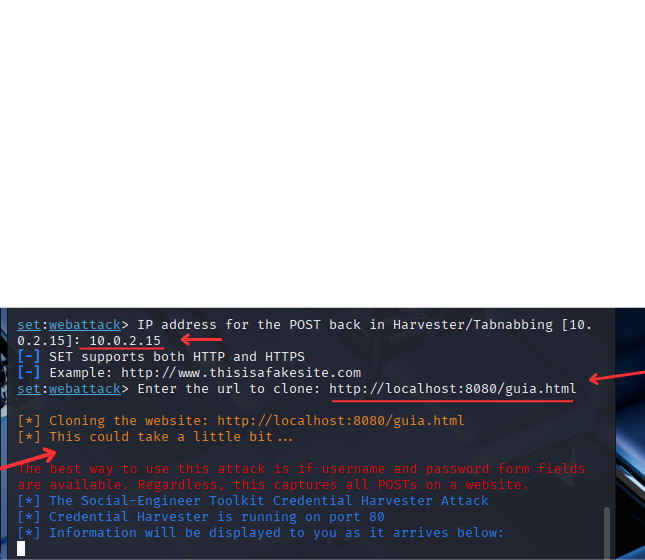
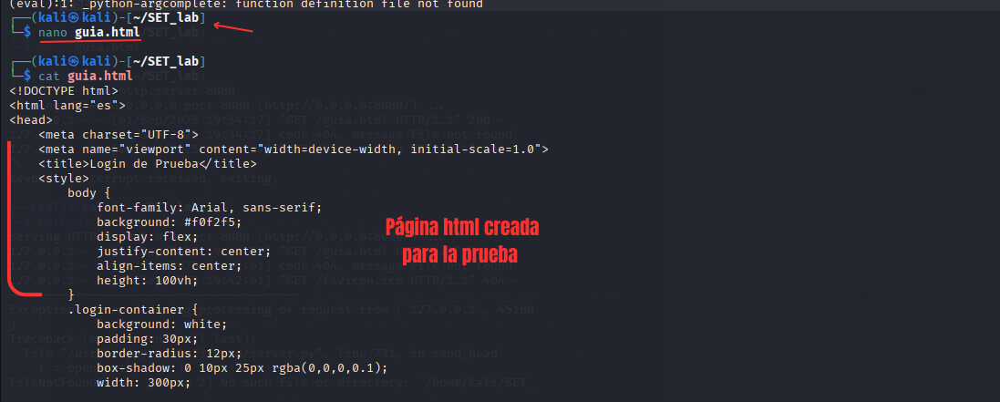
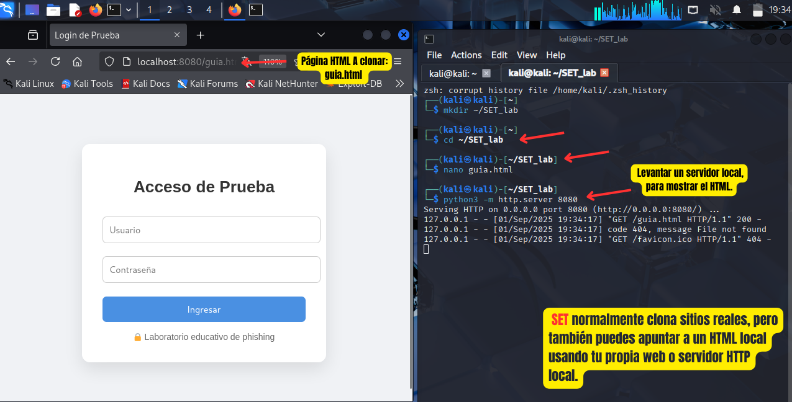
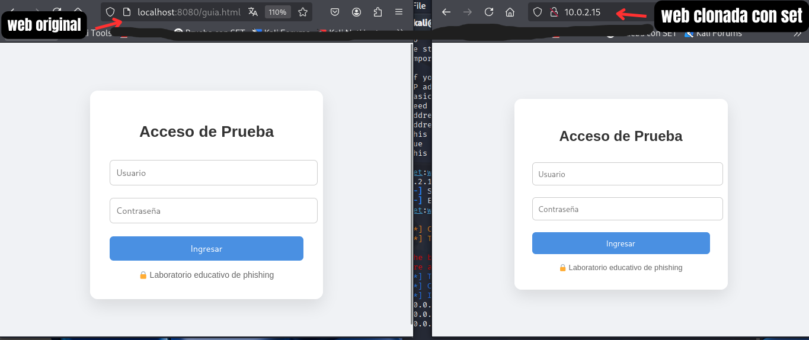

# SET
👉 El objetivo: concienciar sobre cómo se clonan páginas en ataques de phishing y mostrar cómo podemos defendernos.

🔹 Flujo del laboratorio

 1️⃣ Diseñar un archivo HTML de prueba (guia.html) con contenido educativo.
 
 2️⃣ Levantar un servidor local en Python:
 
 🔸 python3 -m http.server 8080
 
 3️⃣ Ejecutar SET → Social-Engineering Attacks → Website Attack Vectors → Credential Harvester → Site Cloner.
 
 4️⃣ Indicar la IP(local) de la máquina y la URL a clonar
 
 🔸 10.0.2.15 y http://localhost:8080/guia.html
 
 5️⃣ SET clona la página y la sirve en http://IP_VM
 

## Resultado

 ✅ página clonada accesible en el navegador, IDÉNTICA a la página original.
 
 ✅ SET levanta su propio servidor y (si hay fomulario) puede CAPTURAR INTERACCIONES para mostrar cómo funciona un ataque real de phishing.
 

